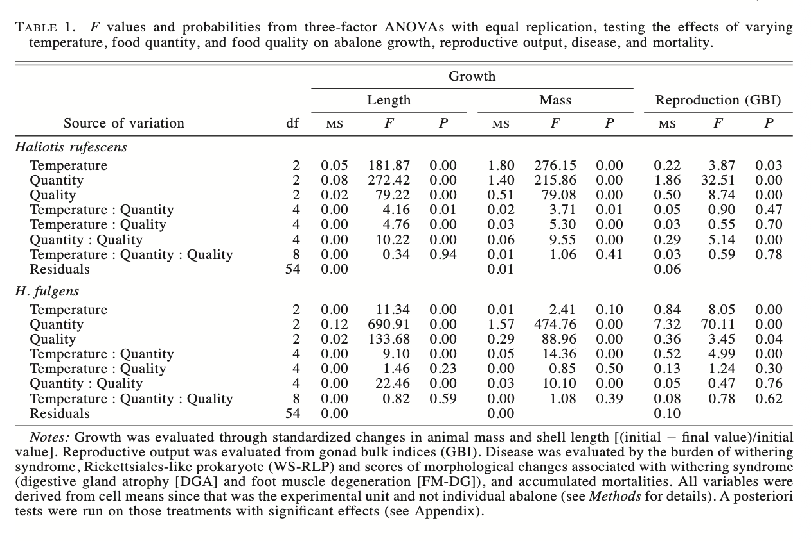
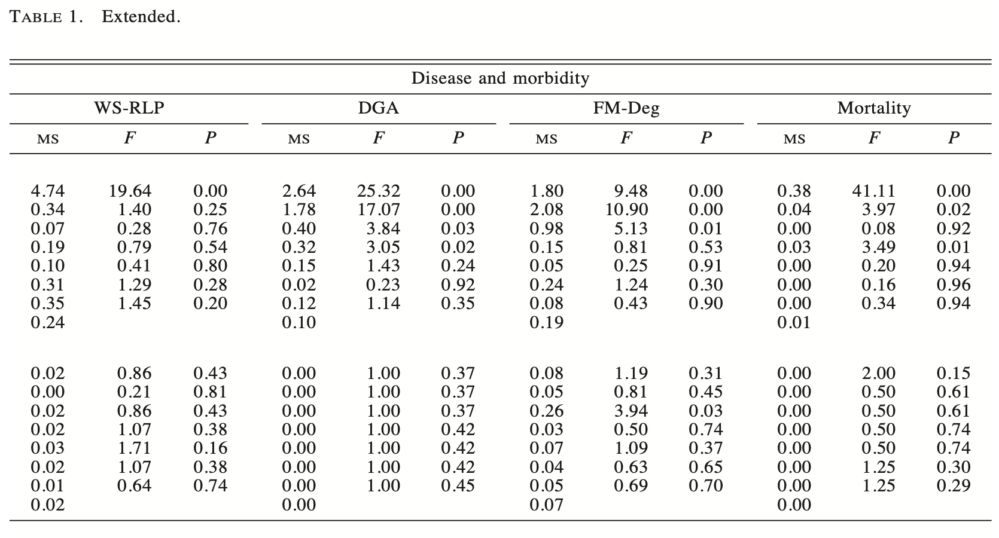

# Set up

```{r}
#| label: packages and data

# read in packages
library(tidyverse) # general use
library(here) # file organization
library(janitor) # cleaning data frames
library(readxl) # reading excel files
library(scales) # modifying axis labels
library(ggeffects) # getting model predictions
library(ggplot2)
library(MuMIn) # model selection
library(dplyr)

# reading in data
kelp <- read_csv(here("data", "temp-kelp.csv"))
my_data <- read_csv(here("data", "envs193ds-personal-data.csv"))
```


# Problem 1. Giant kelp fronds

## a. An appropriate test
To determine the strength of the relationship between temperature and giant kelp frond elongation rate, I can test for the correlation between the two continuous variables using Pearson's correlation (r) or Spearman rank ($\rho$). Pearson's correlation is used when variables are continuous and normally distributed; Pearson's r represents the linear relationship between two variables and is used for parametric studies. In contrast, Spearman rank correlation is the non parametric version which describes monotonic relationship between variables. 

## b. Create a visualization

```{r}
#| label: scatterplot

# scatterplot for temperature vs kelp growth rate
# base layer: kelp data
ggplot(data = kelp,
       # x-axis: temperature
       # y-axis: elongation rate
       mapping = aes(x = temp_c,
                     y = kelp_elong)) +
  # first layer: points to represent individual kelp observations
  # changed point size, stroke, shape, and color from defaults 
  geom_point(size = 2,
             stroke = 1,
             shape = 21,
             fill = "darkgreen") + 
  # relabeled x- and y-axes
  # added title
  labs(x = "Ocean Temperature (ºC)", 
       y = "Kelp Elongation Rate (cm/day)",
       title = "Kelp Grows Faster at Cooler Ocean Temperatures") +
  # changed theme from default
  theme_minimal()
```
**Note**: There appears to be a negatively linear relationship between kelp growth and ocean temperature. In other words, kelp growth rate decreases at increased ocean water temperatures. 

## c. Check your assumptions and run your test

### Assumption checks

**Check 1**: The data includes independent observations, and both variables are continuous.  

**Check 2**: Linearity was assessed in Question 1b. There appears to be a negative linear relationship between kelp growth and ocean temperature seen through the created scatterplot.    

**Check 3**: Normality was assessed using two QQ plots, one for each variable. 
```{r}
#| label: temperature-QQ-plot

# base layer: ggplot
# data frame: kelp
ggplot(data = kelp,
       # y-axis: temperature
       aes(sample = temp_c)) +
  # first layer: reference line colored red
  geom_qq_line(color = "red") +
  # second layer: QQ plot
  geom_qq()
```
**Note**: The data for ocean temperature appears to be normally distributed. 

```{r}
#| label: elongation-QQ-plot

# base layer: ggplot
# data frame: kelp
ggplot(data = kelp,
       # y-axis: kelp elongation
       aes(sample = kelp_elong)) +
  # first layer: reference line colored red
  geom_qq_line(color = "red") +
  # second layer: QQ plot
  geom_qq()
```
**Note**: The data for kelp elongation appears to be normally distributed. 

**Summary of assumption checks**: The data includes independent observations, and both variables are continuous. Linearity was assessed by looking at the scatterplot created in 1b and was met. Normality was assessed using Q-Q plots; both variables appear normally distributed as the data aligns closely with the red reference line. Finally, no significant outliers were detected from the scatterplot. Therefore, all assumptions for Pearson's correlation were met.

### Running the test

```{r}
#| label: Pearson's-test

# ran Pearson's test for correlation
# variables: ocean temperature and kelp elongation rate
cor.test(kelp$temp_c, kelp$kelp_elong, 
         method = "pearson") # Pearson's r
```

## d. Results communication
To evaluate the strength of the relationship between temperature and giant kelp frond elongation rate, I used a Pearson's correlation test. I found a strong negative linear relationship between ocean temperature (ºC) and giant kelp elongation rate (cm/day) (Pearson’s r = -0.69, t(30) = -5.19, p < 0.001, ⍺ = 0.05). Therefore, the null hypothesis should be rejected because there is a strong relationship between ocean water temperature and giant kelp frond elongation rate. 

## e. Test implications
The results outlined above indicate that giant kelp frond growth rate decreases with increased ocean water temperatures. Therefore, warming ocean temperatures from climate change could threaten giant kelp productivity and species that rely on healtyh giant kelp ecosystems. 

## f. Double check your work 
```{r}
#| label: Spearman-test

# ran Spearman rank test for correlation
# variables: ocean temperature and kelp elongation rate
cor.test(kelp$temp_c, kelp$kelp_elong, 
         method = "spearman", # Spearman rank
         exact = FALSE)
```

Both tests led to the same decision which is to reject the null hypothesis because there is a strong negative correlation between ocean temperature and giant kelp frond growth rate. Using the Spearman rank test, I found a strong negative monotonic relationship between ocean temperature (ºC) and giant kelp elongation rate (cm/day) (Spearman ($\rho$) = -0.69, S = 9216.1, p < 0.001, ⍺ = 0.05). Both tests produced correlation coefficients of -0.69 and p-values of less than 0.001, suggesting that warmer temperatures tend to produce lower kelp growth rates. 


# Problem 2. Personal data

## a. Updating your visualizations

**Figure 1**:
```{r}
#| label: my-data-categorical-visualization
# boxplot with jitter to visualize workout duration vs workout type

# cleaned column names
my_data <- my_data |> 
  clean_names()

# base layer: ggplot with x- and y-axes
# data frame: my_data
ggplot(data = my_data,
       # x-axis: workout type (categorical predictor variable)
       # y-axis: workout duration (response variable)
       mapping = aes(x = workout_type,
                     y = duration_min,
                     # colored points by workout type
                     color = workout_type)) +
  # first layer: boxplot to show distribution
  geom_boxplot() +
  # second layer: jitter to show underlying data
  geom_jitter(height = 0, # no jitter in vertical direction
              width = 0.2, # narrowed jitter in horizontal direction
              alpha = 0.5, # made points more transparent
              shape = 1) + # changed points to be open circles
  # changed colors from default
  scale_color_manual(values = c("Lift" = "darkgreen",
                                "Run"  = "navyblue",
                                "Surf" = "darkorange",
                                "Yoga" = "darkred")) +
  # relabeled x- and y-axes
  # added title summarizing takeaway
  # added subtitle with recent date
  labs(title = "Runs show the most variable workout duration",
       x = "Workout type",
       y = "Workout duration (minutes)",
       subtitle = "Most recent observation: 2026-05-26") +
  # changed ggplot theme from default
  theme_minimal() +
  # removed legend
  theme(legend.position = "none")
```

**Figure 2**:
```{r}
#| label: my-data-continuous-visualization
# boxplot with jitter: workout type vs sleep the previous night (hours)

# base layer: ggplot with x- and y- axes
# data frame: my_data
ggplot(data = my_data,
       mapping = aes(x = workout_type,
                     y = sleep_hours,
                     color = workout_type)) +
  # first layer: boxplot to show distribution
  geom_boxplot() +
  # second layer: jitter to show underlying data
  geom_jitter(height = 0, # no jitter in vertical direction
              width = 0.2, # narrowed jitter in horizontal direction
              alpha = 0.5, # made points more transparent
              shape = 1) + # changed points to be open circles
  # changed colors from default
  scale_color_manual(values = c("Lift" = "darkgreen",
                                "Run"  = "navyblue",
                                "Yoga" = "darkred",
                                "Surf" = "darkorange")) +
  # relabeled x- and y-axes
  # added title summarizing main message
  # added subtitle with recent date
  labs(title = "More sleep is associated with going on runs",
       x = "Workout type",
       y = "Sleep the previous night (hours)",
       subtitle = "Most recent observation: 2026-05-26") +
  # changed ggplot theme from default
  theme_minimal() +
  # removed legend
  theme(legend.position = "none")
```

## b. Captions

**Figure 1. Runs show the most variable workout duration.** Points represent individual workout sessions (n = 30, most recent observation: 2026-05-26). Colors represent workout type (green: lift, blue: run, yellow: surf, red: yoga). Boxes show the median and interquartile range of workout duration (minutes) for each workout type (lift, run, surf, yoga). Note that surf sessions (n = 2) are limited in sample size.

**Figure 2. More sleep is associated with going on runs.** Points represent individual workout sessions (n = 30, most recent observation: 2026-05-26). Colors represent workout type (green: lift, blue: run, yellow: surf, red: yoga). Boxes show the median and interquartile range of sleep the previous night (hours) for each workout type (lift, run, surf, yoga). Note that surf sessions (n = 2) are limited in sample size.


# Problem 3. Affective visualization

## a. Describe your affective visualization


## b. Create a paper sketch of your idea
```{r}
#| label: insert-sketch-photo
#| echo: false

```


## c. Make a draft of your visualization


## d. Write an artist statement


## e. Prep your materials to share in class


# Problem 4. Statistical critique

## a. Revist and summarize
The statistical tests the authors use are three-factor ANOVAs with equal replication to test the effects of temperature, food quantity, and food quality on abalone growth (shell length and body mass), reproductive output (gonad bulk index), disease burden (WS-RLP score), and mortality. Each response variable is tested separately, and the ANOVA also tests all two-way and three-way interactions among the three predictors. Additionally, the authors apply multivariate analyses (cluster analysis and multidimensional scaling based on Euclidean distances) to examine how the 27 treatment combinations group together across all response variables simultaneously.

```{r}
#| label: insert-anova-photo
#| echo: false



```

## b. Visual clarity
Table 1 presents the ANOVA results organized by species and divided into response variable columns for growth, reproduction, disease, and mortality. Although Table 1 allows for clear comparison of how each predictor affects each outcome across species, it includes so many information that it had to be extended into two tables. Furthermore, the table only reports MS, F, and p-values with no indication of the direction or magnitude of effects, so viewers cannot assess whether warm temperature increased or decreased growth.

## c. Aesthetic clarity
Table 1 table has a high data to ink ratio because the authors present dense statistical information in a compact grid without colors or borders. Nonetheless, I find the Table difficult to follow due to the sheer amount of information it provides. Furthermore, significant p-values are not visually distinguished with asterisks or text modifications, making it harder for viewers to see key results.

## d. Recommendations
**Recommendations**:
To improve Table 1, I recommend adding asterisks for p-values less than 0.05 (the significance level) to improve readability of important takeaways. I would also recommend adding an effect size column such as eta-squared to indicate the strength of the relationship between variables. 

**Additional figure**: 
I recommend a bar chart displaying mean growth (specifying either mass or length) on the y-axis and temperature treatment (cool, ambient, warm) on the x-axis; bars would be grouped and colored by species (example: red for H. rufescens, green for H. fulgens). This figure would allow for direct species comparison across temperature levels and would convey the direction and magnitude of the effect of temperature on abalone growth.  

---

